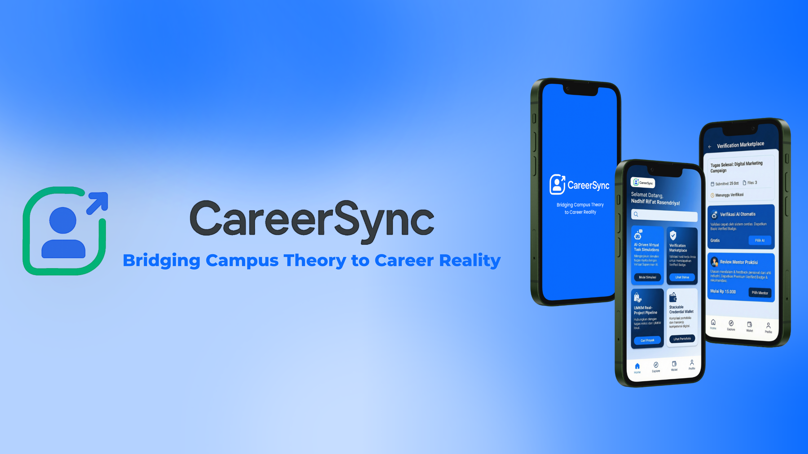

# CareerSync — Landing Page



**CareerSync** adalah platform akselerasi karir berbasis AI yang dirancang untuk membantu Gen-Z menutup *skills gap*. Kami menjembatani teori kampus dengan realita industri melalui simulasi tugas nyata (*Micro-Internships*) dan validasi mentor terpercaya.

> **Tagline:** Simulate Work, Verify Skills, Get Hired!

🔗 **Demo:** [Lihat Demo](https://nadhif-royal.github.io/careersync-landingpage/) *(Pastikan GitHub Pages diaktifkan)*

## 🚀 Tentang Proyek

Website ini adalah Landing Page resmi untuk memperkenalkan ekosistem CareerSync. Didesain dengan pendekatan **Mobile-First** dan estetika modern yang bersih, website ini menjelaskan fitur utama, proposisi nilai, dan visi produk kepada calon pengguna (Mahasiswa & Fresh Graduate).

### Fitur Utama Produk (Dijelaskan di Web):
1.  **AI-Driven Micro-Internships:** Simulasi tugas interaktif dipandu oleh Generative AI.
2.  **Verification Marketplace:** Validasi hasil kerja oleh Mentor Praktisi & UMKM.
3.  **UMKM Real-Project Pipeline:** Menghubungkan mahasiswa dengan proyek nyata berdampak ekonomi.
4.  **Stackable Credential Wallet:** Portofolio digital yang terverifikasi dan siap ekspor.

## 🛠️ Teknologi yang Digunakan

Proyek ini dibangun menggunakan teknologi web standar tanpa *framework* berat untuk memastikan performa yang cepat dan ringan:

* **HTML5:** Struktur semantik.
* **CSS3:** Styling modern menggunakan CSS Variables (`:root`), Flexbox, Grid, dan Media Queries untuk responsivitas.
* **JavaScript (Vanilla):** Interaktivitas untuk Slider, Accordion, dan Navbar (tanpa jQuery/Library eksternal).
* **Phosphor Icons:** Pustaka ikon yang bersih dan modern.

## 📂 Struktur Folder

```text
careersync-landingpage/
├── index.html              # Halaman utama
├── css/
│   └── style.css           # Styling utama (Color Palette & Layout)
├── js/
│   └── main.js             # Logika interaksi (Slider & Dropdown)
└── assets/                 # Aset gambar & ikon
    ├── TransparentLogo...
    ├── UIFrame...
    ├── CEO_Nadhif.png
    └── ...
````

## 🎨 Color Palette

Desain menggunakan kombinasi warna Biru yang melambangkan kepercayaan dan teknologi:

  * **Light:** `#E7F0FF` (Backgrounds)
  * **Primary:** `#0D6DFF` (Buttons, Highlights)
  * **Dark:** `#0A52BF` (Hover States)
  * **Darker:** `#052659` (Text, Footer)

## 📦 Cara Menjalankan

1.  **Clone** repositori ini:
    ```bash
    git clone [https://github.com/nadhif-royal/careersync-landingpage.git](https://github.com/nadhif-royal/careersync-landingpage.git)
    ```
2.  Buka folder proyek.
3.  Klik dua kali `index.html` untuk membuka di browser.

## 👤 Author

**Nadhif Rif'at Rasendriya**

  * Product Manager & Founder of CareerSync
  * [LinkedIn](https://www.linkedin.com/in/royalnadhif50/)
  * [Instagram](https://www.instagram.com/royal_nadhif/)

-----

© 2025 CareerSync. All rights reserved.

```
```
